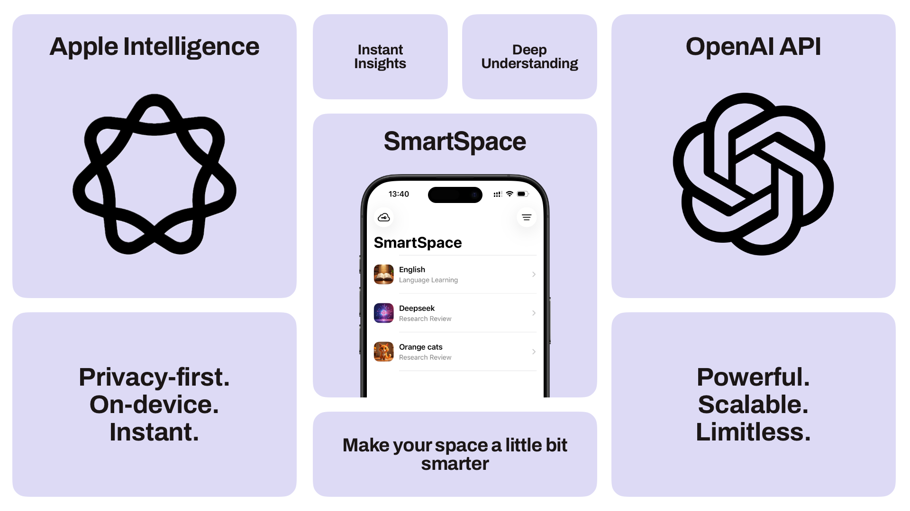

  

### Summary

**SmartSpace** is an iOS app that helps you manage documents and information with Apple Intelligence models. Create Spaces, upload files, and instantly get helpful blocks like summaries, flashcards, quizzes, and more — plus you can ask questions about what you uploaded.

SmartSpace supports two modes:

- **Apple Intelligence**: Apple’s on-device (and Private Cloud Compute where applicable) models for text generation, plus on-device Image Playground for cover images.
- **GPT**: blocks are generated via OpenAI, while the cover image is generated on-device (Image Playground).

---

### What are the compelling reasons to use this app?

Did you ever feel like you’re trying to piece together a puzzle with all those noisy documents and weird words and rules? Maybe you’ve got a mountain of lectures to soak up, or you’re overwhelmed by the sheer number of pages in documentation.

No worries — SmartSpace has your back.

Create a Space, add your files, and you’ll get a variety of useful blocks (Summaries, Flashcards, Quizzes, Mind Maps/Outlines) generated for you. And if that’s not enough, just ask questions about the information you’ve provided.

---

### Application features

- **Create Spaces** and select their purpose (templates like Learning, Research, etc.).
- **Upload files** and watch blocks appear as they generate.
- **Open blocks** to dive deeper (study views for quizzes, flashcards, terms, and more).
- **Q&A**: ask about the Space and get short, on-topic answers.
- **Space cover image**:
  - auto prompt selection + on-device generation (Image Playground)
  - manual **Custom cover** (opens the iOS Image Playground UI directly)

---

### Variants of Space purposes (Templates)

So, what are these magical templates? Think of them as instant power-ups for your brain — SmartSpace picks the right blocks for the job.

- **Test Preparation**

  - Drop in a big chapter and SmartSpace turns it into a personal cheat sheet:
  - Finds the **Main Question**, then generates **Flashcards** and a **Quiz** to help the info stick.

- **Language Learning**

  - Turns a wall of text into learning tools:
  - Builds **Flashcards**, a **Quiz**, and **Key Terms** that act like a personal dictionary for that text.

- **Lecture Debrief**

  - Perfect for long lectures where your brain checks out after minute five:
  - Figures out the **Main Question**, pulls out key **Insights** and **Key Terms**.

- **Research Analysis**
  - For dense research papers that read like a secret code:
  - Reveals the core **Argument & Counterargument** and the paper’s blueprint with a **Content Outline**.

---

### Variety of blocks available in the app

- **Summary**: Provides a concise, paragraph-style overview of the entire document set.
- **Flashcards**: Creates interactive term/definition cards for active recall and studying.
- **Quiz**: Generates a short, multiple-choice quiz to test your comprehension of the material.
- **Key Terms**: Extracts important terms or names and provides their definitions or context.
- **Main Question**: Identifies the central research question or thesis of the documents.
- **Insights**: Scans documents to discover trends, patterns, or non-obvious conclusions.
- **Argument & Counterargument**: Identifies the primary arguments and any opposing views present in a text.
- **Content Outline**: Generates a hierarchical outline of the document based on its headings and structure.

### Privacy

The goal of the project is to do as much as possible **on-device**. For GPT Spaces, OpenAI requests are only made when you choose the GPT provider and have a key set.
